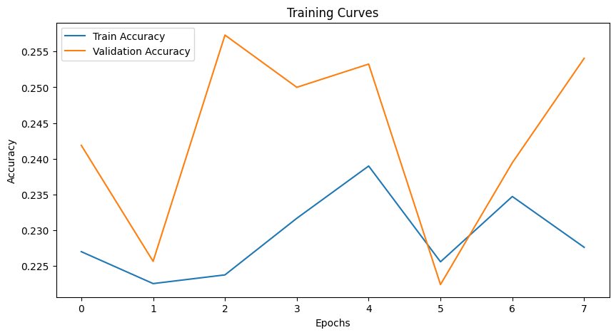
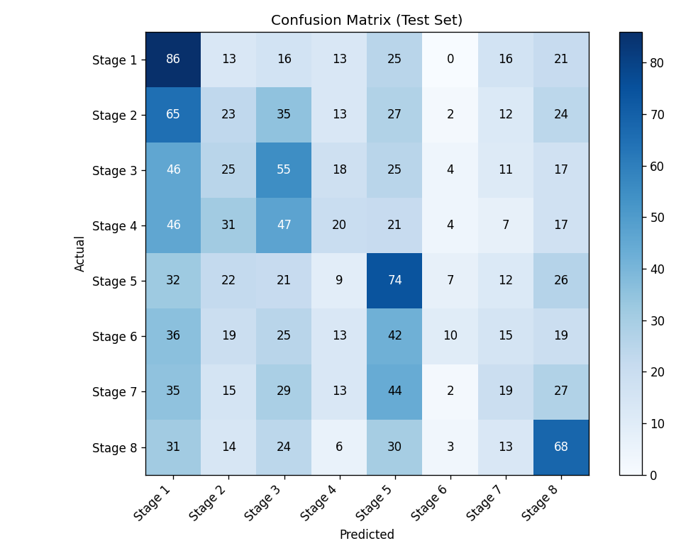

# Handwashing Stage Classification with CNN

A deep learning project that classifies images of hand washing into the **8 stages of the WHO handwashing technique**. It uses transfer learning with a **MobileNetV2** convolutional neural network (CNN) built in TensorFlow/Keras.

This project was completed as university coursework.

## Project Overview

Correct handwashing follows a fixed sequence of steps. An image classifier that recognises which stage is being performed could support automated hygiene training or compliance monitoring. The model takes a 150×150 image of hands and predicts one of 8 stages.

## Tools and Libraries

- **Python**
- **TensorFlow / Keras** for building and training the CNN
- **MobileNetV2** (pre-trained on ImageNet) as the feature extractor
- **Scikit-learn** for data splitting and evaluation metrics
- **NumPy** for handling image arrays
- **Matplotlib** for plotting training curves
- **Google Colab** with Google Drive for storage and GPU training

## Dataset

- **7,697 images** of hands at 150×150 pixels (RGB), labelled with 8 handwashing stages
- Label errors were detected and removed in a separate cleaning step before training, so this notebook loads the cleaned dataset (`clean_images.npy`, `clean_labels.npy`)

## Workflow

### 1. Data Splitting
The data was split with stratified sampling so every stage keeps the same proportion in each set:

| Set | Images |
|---|---|
| Training | 4,925 |
| Validation | 1,232 |
| Test | 1,540 |

### 2. Data Augmentation
To help the model generalise, training images were randomly transformed with:
- rotation (up to 20°)
- width and height shifts
- zoom
- horizontal flips

### 3. Model Architecture
Transfer learning with MobileNetV2:
- **Base:** MobileNetV2 pre-trained on ImageNet, with its layers frozen
- **Custom head:** Global Average Pooling → Dense (256, ReLU) → Batch Normalisation → Dropout (0.5) → Dense (8, Softmax)
- **Parameters:** 2.59M total, of which 330K are trainable

### 4. Training
- Optimiser: Adam
- Loss: sparse categorical cross-entropy
- Early stopping on validation accuracy (patience 5, restoring the best weights)
- Up to 15 epochs with batch size 32



### 5. Results

**Test accuracy: 23%**

With 8 classes, random guessing would score about 12.5%, so the model learned some patterns, but its performance is limited. It did best on Stage 1, Stage 5 and Stage 8, and struggled most with Stage 6, where recall was only 6%.

| Stage | Precision | Recall | F1-score |
|---|---|---|---|
| Stage 1 | 0.23 | 0.45 | 0.30 |
| Stage 2 | 0.14 | 0.11 | 0.13 |
| Stage 3 | 0.22 | 0.27 | 0.24 |
| Stage 4 | 0.19 | 0.10 | 0.13 |
| Stage 5 | 0.26 | 0.36 | 0.30 |
| Stage 6 | 0.31 | 0.06 | 0.09 |
| Stage 7 | 0.18 | 0.10 | 0.13 |
| Stage 8 | 0.31 | 0.36 | 0.33 |



Many handwashing stages look very similar in a single still image, such as the different rubbing motions, which makes them hard to tell apart.

### 6. Inference
The trained model predicts a stage for each new image by choosing the class with the highest probability, then maps it to a readable name such as "Stage 3".

## What I Learned and Next Steps

The training curves stayed flat at around 22–25%, which shows the model was underfitting rather than overfitting. Improvements I would try next:
- **Use MobileNetV2's own preprocessing** (`preprocess_input`, which scales pixels to [-1, 1]) so the images match what the pre-trained weights expect
- **Fine-tune the top layers** of MobileNetV2 instead of keeping them all frozen
- **Train for more epochs** with a lower learning rate
- **Resize images to 224×224**, the input size MobileNetV2 was originally trained on
- **Use temporal information** from video frames, since handwashing stages are defined by motion

## How to Run

1. Clone this repository:
   ```bash
   git clone https://github.com/noorbushra470-alt/handwashing-cnn-classifier.git
   ```
2. Open `handwashing_cnn_classifier.ipynb` in Google Colab.
3. Place the cleaned dataset files (`clean_images.npy` and `clean_labels.npy`) in your Google Drive and update `data_path` in the notebook to point to them. The dataset was provided by the university and is not included in this repository.
4. Run all cells. A GPU runtime is recommended (Runtime → Change runtime type → GPU).
